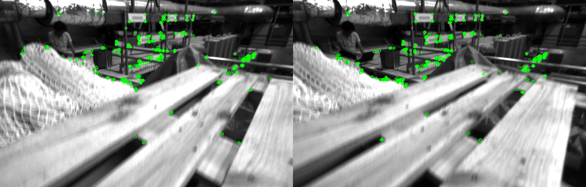
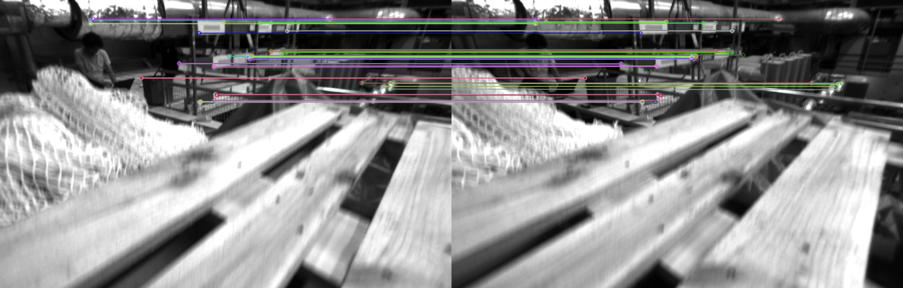
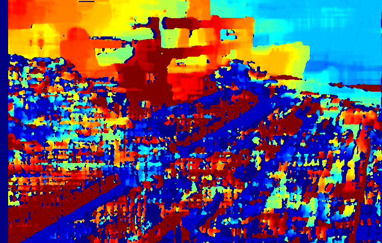
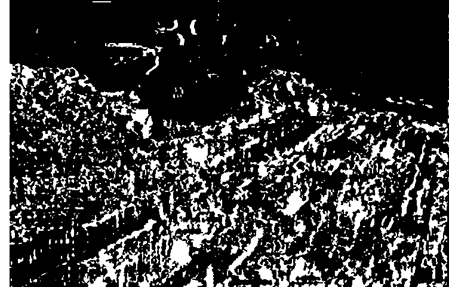

# Stereo Visual Simultaneous Localization and Mapping (Stereo Visual - SLAM)
WIP implementation of stereo visual SLAM using Python and OpenCV on [the EuRoC MAV dataset](https://projects.asl.ethz.ch/datasets/doku.php?id=kmavvisualinertialdatasets). 

## Current Progress:
### Feature Extraction

### Feature Matching

### Disparity Map

### Depth Map

